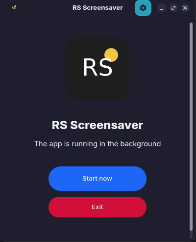
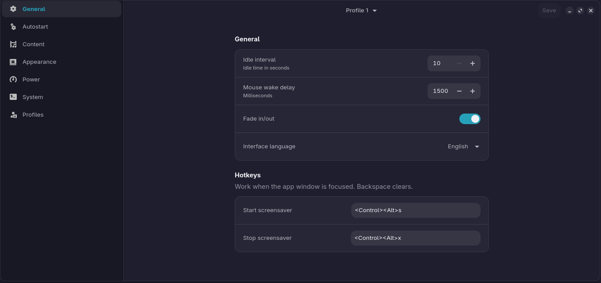
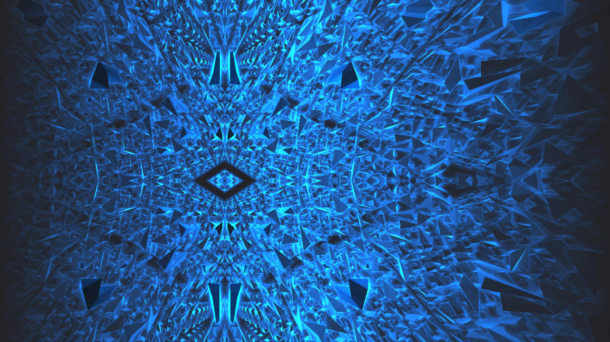

# Vesper

[English](README.md) | [Русский](README_ru.md)

Десктопный скринсейвер для Linux, написанный на Rust и GTK4.

## Возможности

- Приложение в системном трее с быстрыми действиями, профилями и статусами
- Режимы: цвет, градиент, паттерн, веб‑страница, потоковое видео, изображение, видео, слайдшоу (папка), GLSL шейдер (Shadertoy), Python скрипт
- Пользовательские GLSL шейдеры (Shadertoy‑style): один файл или multipass‑папки (Common/Image/BufferA–D), опционально `Sound.glsl`
- Библиотека Shaderpacks (шейдерпаки): импорт папок/`.zip`, превью и выбор внутри режима GLSL
- Режим Python‑скрипта (`.py`) для процедурных/комьюнити‑паттернов без перекомпиляции
- Список случайных медиа для изображений/видео
- Оверлей часов с настройкой формата, позиции, размера и движения
- Профили с быстрым переключением (в том числе из трея)
- Горячие клавиши запуска/остановки
- Автозапуск
- Интеграция питания (блокировка сна, блокировка экрана в KDE/GNOME)
- Импорт/экспорт настроек (JSON)
- История активаций
- Команды панелей (скрыть/показать панели при активации)
- Определение простоя X11 + Wayland (ext-idle-notify-v1, fallback через D-Bus GNOME)
- Интерфейс на русском и английском (автоопределение)

## Требования

- Rust toolchain (stable)
- GTK4 и libadwaita (dev пакеты)
- Опционально: WebKitGTK 6 для режима веб‑страниц (название пакета зависит от дистрибутива)
- Runtime: GStreamer плагины для воспроизведения видео, если их нет в системе
- Опционально: OpenGL 3.3 + `libGL.so.1` (GLSL шейдеры / Python‑скрипт)
- Опционально: `python3` (или `python`) в `PATH` (Python‑скрипт)
- Опционально: `pw-cat` (PipeWire) или `paplay` (PulseAudio) для `Sound.glsl`
- Опционально: `bsdtar` для импорта shaderpack `.zip` архивов

### Пакеты Linux (примеры)

**Ubuntu/Debian:**
```bash
sudo apt install libgtk-4-dev libadwaita-1-dev
```

**Fedora:**
```bash
sudo dnf install gtk4-devel libadwaita-devel
```

**Arch Linux:**
```bash
sudo pacman -S gtk4 libadwaita
```

## Сборка

```bash
cargo build --release
```

## Запуск

```bash
# Из исходников
cargo run --release

# Или напрямую
./target/release/vesper
```

## GLSL шейдеры (Shadertoy‑style)

- Включение: **Настройки → Контент → “GLSL шейдер”**
- Можно выбрать один файл (`.glsl` / `.frag` / `.fs`) или папку с `Image.glsl` (рядом автоматически подхватываются `Common.glsl`, `BufferA..D.glsl`, `Sound.glsl`)
- Shaderpacks: импортируйте в **Настройки → Shaderpacks**, затем выберите **Источник: Shaderpack** в режиме GLSL
- Документация: `docs/SHADERTOY_SHADERS.md` (формат/uniforms) и `docs/SHADERPACKS.md` (shaderpacks)

## Python‑скрипты

- Включение: **Настройки → Контент → “Python скрипт”**
- Выберите `.py` файл (см. `example.py`)
- Документация: `docs/PYTHON_PLUGINS.md` (API)

## AppImage

Нужен установленный `appimagetool`.

```bash
bash scripts/build_appimage.sh
```

AppImage появится в `dist/vesper-<arch>.AppImage`.

## Debian/Ubuntu (.deb)

Нужен `dpkg-deb` (пакет: `dpkg-dev`).

```bash
bash scripts/build_deb.sh
```

`.deb` появится в `dist/deb/vesper_<version>_<arch>.deb`.

## CLI управление (D-Bus)

```bash
./target/release/vesper status
./target/release/vesper start
./target/release/vesper stop
./target/release/vesper show-settings
./target/release/vesper show
./target/release/vesper enable
./target/release/vesper disable
./target/release/vesper inhibit
./target/release/vesper uninhibit
./target/release/vesper set-enabled true
./target/release/vesper set-inhibit false
./target/release/vesper switch-profile 2
./target/release/vesper quit
```

## Меню в трее

- Переключатели «Включено», «Блокировать сон», «Игнорировать блокировку бездействия» и «Запуск заставки по клику на значок»
- Подменю профилей
- Настройки, Запустить, Выход
- При левом клике на значок в трее сразу запускается заставка (поведение настраивается)

## Скриншоты





## Конфигурация

- Файл настроек: `~/.config/vesper/config.json`
- Профили и параметры режимов хранятся отдельно для каждого профиля
- Shaderpacks (установленные): `~/.local/share/vesper/shaderpacks` (или `XDG_DATA_HOME`)
- Вспомогательный host‑скрипт Python: `~/.cache/vesper/python_plugin_host.py` (или `XDG_CACHE_HOME`)

## Архитектура

- `src/main.rs`: вход в приложение, D-Bus, трей
- `src/config.rs`: модель настроек и сохранение
- `src/idle.rs`: определение простоя X11/Wayland/GNOME
- `src/ui/shadertoy.rs`: запуск пользовательских GLSL шейдеров (Shadertoy‑style), multipass + звук
- `src/shaderpacks.rs`: загрузка/импорт shaderpacks и хранение
- `src/ui/python_plugins.rs`: Python‑скрипт режим (процесс + RGBA кадры)
- `src/ui/settings/*`: окно настроек
- `src/ui/saver.rs`: полноэкранное окно скринсейвера

## Примечания

- На Wayland требуется поддержка `ext-idle-notify-v1` в композиторе.
- В GNOME используется fallback через D-Bus (Mutter IdleMonitor).
- Если видео не воспроизводится, установите необходимые GStreamer плагины.
- Пользовательские GLSL шейдеры и Python‑скрипты не sandbox’ятся (могут повесить/уронить GPU/процесс). Настройте горячую клавишу “Принудительное закрытие” для аварийного выхода.

## Известные ограничения

- Работа трея зависит от поддержки вашего окружения рабочего стола.
- Для некоторых форматов видео нужны дополнительные плагины GStreamer.
- На Wayland не будет определения простоя, если композитор не поддерживает `ext-idle-notify-v1`.
- Режим веб‑страниц требует установленный WebKitGTK.
- Каналы текстур в GLSL ограничены (см. `docs/SHADERTOY_SHADERS.md`).

## Лицензия

MIT License
